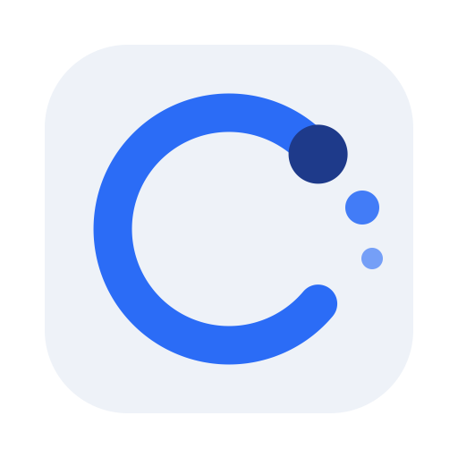

<div align="center">



# Aircord

**The serial console for devices that no longer have a serial port.**

[](LICENSE)

</div>

Aircord is a desktop GUI for BLE devices that expose a **serial-over-BLE**
interface — NB-IoT and LoRaWAN modems, field sensors, and any peripheral that
speaks AT commands over a Nordic UART or HM-10 (`0xFFE1`) GATT profile.

Scan for advertising devices, pick one, connect, and you have an interactive AT
console: type commands, watch replies stream back, and reuse a searchable
per-device history. Beyond the raw console, Aircord adds the three things that
make field work bearable — a **control panel** of named buttons instead of AT
syntax, **playbooks** that replay a provisioning sequence step by step, and
**sessions** that bring your working set back after a break.

Built with [Fyne](https://fyne.io) and
[tinygo.org/x/bluetooth](https://github.com/tinygo-org/bluetooth).

## Features

- **Scan** — live device list (name / RSSI / address) with a regex or substring
  filter. Click a column header to sort by it, again to reverse; the default is
  strongest signal first.
- **Connect** — auto-detects the UART profile (Nordic UART or HM-10 `0xFFE1`),
  dumps the GATT table, and optionally sends a PIN once the link settles. The
  PIN is never written to the log.
- **AT console** — send commands, `\n`-reassembled replies stream into the
  terminal. Press `Up` for an fzf-style searchable history, kept per device.
- **Control panel** — a device template turns AT syntax into labelled buttons,
  inputs, dropdowns and read-outs. Actions can be marked as destructive, and
  are then confirmed before they fire. See [Device templates](docs/device-templates.md).
- **Playbooks** — replay a provisioning sequence, waiting for each device
  acknowledgement before moving on. See [Playbooks](docs/playbooks.md).
- **Firmware update** — flash a Dragino NB-IoT node over BLE: reset it into
  its bootloader, catch the IMEI advertisement, erase, flash, verify, reboot.
  See [Firmware update](docs/firmware-update.md).
- **Sessions** — save and restore the device list, selected target and template.
- **Log tools** — copy the transcript or save it to a timestamped file.
- **Resilient link handling** — device resets and out-of-range drops are
  reflected in the UI instead of freezing it.

## Documentation

| Guide | What it covers |
| ----- | -------------- |
| [Getting started](docs/getting-started.md) | Install, first scan, first connection |
| [Provisioning a sensor](docs/provisioning.md) | End-to-end field workflow |
| [Playbooks](docs/playbooks.md) | Command sequences and their syntax |
| [Device templates](docs/device-templates.md) | Building a control panel in TOML |
| [Firmware update](docs/firmware-update.md) | Flashing a Dragino NB node over BLE |
| [Troubleshooting](docs/troubleshooting.md) | When it doesn't connect or reply |

## Requirements

- **Go 1.25+** (to build from source)
- **macOS** — developed and runtime-tested here (uses CoreBluetooth). CI builds
  Linux and Windows packages too, but their runtime is **unverified**.
- Bluetooth enabled. macOS prompts for Bluetooth permission on the first scan.

## Download

Packages for macOS, Linux and Windows are attached to each
[tagged release](https://github.com/altipard/aircord/releases).
The macOS app is unsigned — right-click → *Open* on first launch.

## Build and run

Using [Task](https://taskfile.dev) (`brew install go-task/tap/go-task`):

```sh
task run          # build and run
task build        # -> ./bin/aircord
task package      # native app bundle (macOS .app, Linux .tar.xz, Windows .exe)
task check        # gofmt check + go vet + golangci-lint + tests
task --list       # all tasks
```

Or plain Go:

```sh
go run .
go build -o bin/aircord .
go test ./...
```

> `task run` and `go run .` start a bare binary. On macOS the Dock then shows
> the icon of whatever launched it — usually Terminal — because the app's own
> icon and identity live in the `.app` bundle. Use `task package` and launch
> `Aircord.app` to see the real thing.

## Supported UART profiles

| Profile | Write UUID | Notify UUID |
| ------- | ---------- | ----------- |
| Nordic  | UART RX    | UART TX     |
| HM-10   | `0xFFE1`   | `0xFFE1`    |

The HM-10 (`0xFFE1`) profile covers TI CC254x transparent-UART modules — for
example the Dragino D20S-NB. To support another device, read the GATT dump in
the terminal and add its write/notify UUIDs to `uartProfiles` in
`internal/ble/ble.go`.

## Where your data lives

Everything Aircord persists sits under the OS user-config directory:

| Path | Contents |
| ---- | -------- |
| `<config>/aircord/history.json` | per-device command history |
| `<config>/aircord/sessions/` | saved sessions (mode `0600` — they contain the PIN) |
| `<config>/aircord/playbooks/` | saved command sequences |
| `<config>/aircord/templates/` | your own device templates |
| `<config>/aircord/logs/` | saved terminal logs |

`<config>` is `~/Library/Application Support` on macOS and
`$XDG_CONFIG_HOME` (default `~/.config`) on Linux.

> Upgrading from the pre-release name `blescan`? The old directory is moved
> across automatically on first launch, so history, sessions and playbooks
> survive.

## Project layout

The Fyne/BLE UI lives in the root `main` package; reusable, GUI-free logic is
split into `internal/` packages, each unit-tested.

| Path | Responsibility |
| ---- | -------------- |
| `main.go` | app entry, window, icon |
| `scanner.go` | UI state + widgets; wires the `ble.Client` |
| `scan.go` | scan controls + device-table snapshot/filter |
| `connect.go` | connect/disconnect flow + `ble.Events` handling |
| `panel.go` | control panel rendered from a device template |
| `session_ui.go` | modal helper, session save/load dialog |
| `playbook_ui.go` | playbook editor and runner |
| `ota_ui.go` | firmware update: reset into the bootloader, reconnect, flash |
| `terminal.go` | terminal log, alerts and status line |
| `ui.go` | widget construction + layout |
| `widgets.go` | reusable UI pieces (dark theme, alert line, table layout) |
| `history.go` | fzf-style command history picker |
| `internal/ble` | BLE adapter, discovery, connection + AT I/O (GUI-free) |
| `internal/config` | config dir, atomic writes, legacy-dir migration |
| `internal/device` | device template parsing and preset loading |
| `internal/filter` | shared regex/substring filter |
| `internal/history` | per-device command history persistence |
| `internal/otanb` | Dragino NB bootloader flash protocol (frames, CRC, upgrade sequence) |
| `internal/playbook` | playbook persistence, text format, risky-command detection |
| `internal/session` | session persistence |
| `assets/icon.svg` | editable icon source (regen: `go run ./tools/genicon`) |

## Contributing

See [CONTRIBUTING.md](CONTRIBUTING.md). Security reports go to
[SECURITY.md](SECURITY.md).

## License

[MIT](LICENSE) © 2026 Daniel Altiparmak
